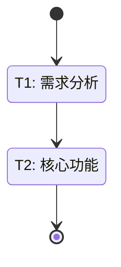

<!-- STATIC_CONTENT: Cacheable (6000+ tokens) -->

# Skills(task:planner) - 计划设计规范

<scope>

当你需要为复杂任务设计执行计划时使用此 skill。适用于深入分析项目结构和技术栈、将复杂任务分解为可执行的子任务、建立任务依赖关系和并行执行策略、为每个任务分配合适的 Agent 和 Skills，以及 Loop 命令的计划设计（Planning / Plan）阶段。

</scope>

<core_principles>

MECE 分解原则要求子任务之间相互独立（Mutually Exclusive，无文件冲突，可独立执行）且完全穷尽（Collectively Exhaustive，覆盖所有必要工作，无遗漏）。

质量标准包括三个方面：可交付原子化（每个任务必须产生可验证的交付物）、可量化可验证（每个任务必须有明确的、可量化的验收标准）、依赖闭环（任务之间的依赖关系必须形成有向无环图 DAG）。

</core_principles>

<red_flags>

| AI Rationalization | Reality Check |
|-------------------|---------------|
| "任务分解已经足够细粒度了" | MECE 原则要求子任务完全独立，操作同一文件即违反，必须检查文件交集 |
| "验收标准是定性的就可以了" | 验收标准必须可量化可验证，"代码改进"不行，"测试覆盖率≥90%"才行 |
| "没有循环依赖就是合理的计划" | 还需验证：并行度≤2、依赖形成DAG、无遗漏任务、agent带中文注释 |
| "这个任务太小，不用拆分了" | 原子性要求每个任务有可交付物和验收标准，"太小"的任务也必须符合 |
| "用户没提出问题就可以跳过确认" | planner 返回的 questions 字段必须处理，不确认等于计划可能被错误执行 |
| "5个并行任务可以分两批执行" | 并行度硬性限制≤2，必须严格遵守，即使有不同的agent也要串行 |
| "已有中文注释，可以省略 depth:1 验证" | 中文注释不等于结构化，必须用 depth:1 检查 agent/skills 是否都带注释 |
| "没有用到 Mermaid 就不用画状态图" | Mermaid 是输出规范的一部分，复杂计划（>5个任务）必须生成 |
| "agent 是可选的，有些任务不需要" | agent 和 skills 在 tasks 不为空时是强制字段，缺失会导致调度失败 |
| "skills 可以留空，让系统自动推断" | skills 必须显式指定，空数组会触发验证错误 |
| "来源必须是 task 插件" | agent/skills 可来自任何插件或项目自定义，来源灵活 |

</red_flags>

<invocation>

调用：`Agent(agent="task:planner", prompt="设计执行计划：\n任务目标：{desc}\n要求：1.分析项目结构 2.收集目标/依赖/现状/边界 3.MECE分解 4.DAG依赖 5.分配Agent+Skills(带中文注释) 6.可量化验收标准 7.报告≤200字\n功能已存在则返回空tasks。")`

**结果处理**：检查 status=completed → 处理 questions(有则询问用户) → tasks为空则直接结束 → validate_plan

**计划验证**：无循环依赖 + 并行组≤2个 + Agent/Skills带中文注释"（" + 每个task有acceptance_criteria

</invocation>

<mermaid_generation_rules>

## Mermaid stateDiagram 生成规范

**关键约束**（必须严格遵守）：
1. **单行文本**：状态描述必须在单行内，**禁止使用 `\n` 换行符**
2. **简洁标签**：每个状态仅包含任务 ID 和简短名称（≤15 字符）
3. **信息分离**：详细信息（agent/skills/files）放在任务清单表格，**不在图中**

**正确示例**：


**错误示例**（禁止）：
```mermaid
state "T1: 需求分析\nagent: analyst" as T1  ❌ 使用了 \n
state "T1: 实现用户认证功能并添加测试覆盖" as T1  ❌ 描述过长
state "T1: 需求分析\n━━━━━━\nagent: xx" as T1  ❌ 多行文本
```

**验证步骤**：
生成 Mermaid 图后，检查：
- [ ] 无 `\n` 换行符
- [ ] 每个状态描述 ≤ 20 字符
- [ ] 图表节点数 ≤ 12 个
- [ ] 无分隔符（━━━━）

</mermaid_generation_rules>

<output_format>

标准输出（有任务需执行）：

```json
{
  "status": "completed",
  "report": "计划：3个子任务。T1：JWT 工具（coder）→ T2：认证中间件（coder）→ T3：测试覆盖（tester）。依赖：T2→T3。预计完成时间：2小时。",
  "tasks": [
    {
      "id": "T1",
      "description": "实现 JWT 工具函数",
      "agent": "coder（开发者）",
      "skills": ["golang:core（核心功能）"],
      "files": ["internal/auth/jwt.go"],
      "acceptance_criteria": [
        "生成和验证 Token 功能完整",
        "单元测试覆盖率 ≥ 90%"
      ],
      "dependencies": []
    }
  ],
  "dependencies": {"T2": ["T1"], "T3": ["T2"]},
  "parallel_groups": [["T1"], ["T2"], ["T3"]],
  "iteration_goal": "完成用户认证功能的实现和测试",
  "acceptance_criteria": ["所有子任务完成", "整体测试通过", "代码质量达标"]
}
```

特殊输出（无需执行任务）：当功能已存在且满足需求、没有找到需要改动的地方、或用户要求已被满足时，返回空 tasks 数组：

```json
{
  "status": "completed",
  "report": "分析结果：用户认证功能已在 internal/auth 模块完整实现。无需额外开发。",
  "tasks": [],
  "dependencies": {},
  "parallel_groups": [],
  "iteration_goal": "确认现有实现满足需求",
  "acceptance_criteria": ["确认功能完整性"]
}
```

</output_format>

<field_reference>

| 字段 | 类型 | 说明 | 必填 |
|------|------|------|------|
| `status` | string | 执行状态：`completed` 或 `questions` | 是 |
| `report` | string | 简短报告（≤200字） | 是 |
| `tasks` | array | 任务列表（可为空数组） | 是 |
| `dependencies` | object | 依赖关系映射 | 是 |
| `parallel_groups` | array | 并行执行分组 | 是 |
| `iteration_goal` | string | 迭代目标 | 是 |
| `acceptance_criteria` | array | 整体验收标准 | 是 |
| `questions` | array | 需要用户确认的问题 | 否 |

Task 对象字段：

| 字段 | 类型 | 必填 | 说明 | 示例 |
|------|------|------|------|------|
| `id` | string | 是 | 任务唯一标识 | `"T1"` |
| `description` | string | 是 | 任务描述 | `"实现 JWT 工具函数"` |
| `agent` | string | 是* | 执行 Agent（必须带中文注释） | `"coder（开发者）"` |
| `skills` | array | 是* | 所需 Skills（每项必须带中文注释） | `["golang:core（核心功能）"]` |
| `files` | array | 否 | 涉及的文件 | `["internal/auth/jwt.go"]` |
| `acceptance_criteria` | array | 是 | 验收标准（支持字符串或结构化对象） | 见 [结构化验收标准](planner-structured-criteria.md) |
| `dependencies` | array | 是 | 前置任务 ID 列表 | `["T1"]` |

\* 注：当 tasks 数组不为空时为必填。tasks 为空数组时（功能已存在场景）无需填写。

结构化验收标准详见 [planner-structured-criteria.md](planner-structured-criteria.md)。

</field_reference>

<references>

- [结构化验收标准](planner-structured-criteria.md) - 精确匹配、量化阈值评估、字段定义、使用示例
- [上下文学习指南](planner-context-learning.md) - 三层上下文学习、项目理解、记忆系统、规范驱动计划
- [Agent/Skills 选择参考](planner-reference.md) - Agent 和 Skills 的选择指南、使用示例
- [避坑指南](planner-pitfalls.md) - 常见错误、最佳实践、验证检查清单
- [集成示例](planner-integration.md) - Loop 集成、验证函数、高级用法

</references>

<guidelines>

始终使用 `Agent(agent="task:planner", ...)` 调用，检查 `status` 字段确认执行状态，处理 `questions` 字段中的用户确认请求。验证依赖关系无循环（使用拓扑排序），验证并行度不超过 2，验证 Agent/Skills 带中文注释，处理空 tasks 数组的特殊情况。

不要跳过计划验证步骤，不要忽略 planner 返回的问题，不要修改 planner 返回的 JSON 结构。常见陷阱包括：过度拆分任务（应合并为原子任务）、验收标准模糊（应可量化）、缺少中文注释、循环依赖、并行度超限。

</guidelines>

<agent_skills_rules>

**Agent/Skills 来源**：task插件内置(`task:planner/verifier/adjuster/explorer-*`) | 其他插件(`golang:dev/python:dev`) | 项目自定义(`.claude/agents/`) | 通用(`coder/tester/devops`)

Skills来源：语言插件(`golang:*/python:*`) | 通用(`documentation/code-review`) | 项目(`.claude/skills/`)

**格式**：`name（中文注释）`或`name（中文注释）@source`。Loop内部必须明确来源，任务执行agent来源灵活。

**强制规则**：tasks非空时，每个任务必须有 agent(带中文注释) + skills(≥1项，带中文注释)。仅 tasks 为空时可省略。

</agent_skills_rules>

<!-- /STATIC_CONTENT -->
