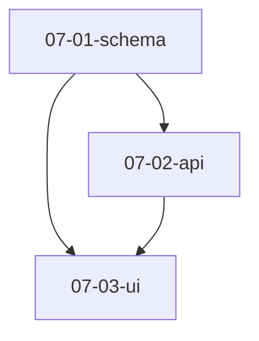

# Trellis 任务看板

| ID | 名称 | 描述 | 状态 | worktree | 前置 |
| --- | --- | --- | --- | --- | --- |
| 07-01-schema | 定义数据 schema | 建立核心表结构 | 已完成 | — | — |
| 07-02-api | 实现 API 层 | 基于 schema 提供读写接口 | 实施中 | ~/wt/api | 07-01-schema |
| 07-03-ui | 前端看板 | 消费 API 渲染看板 | 规划中 | — | 07-01-schema, 07-02-api |

## 依赖关系图 (DAG)

## Worktree ↔ Task 映射

| worktree | task | 创建源 |
| --- | --- | --- |
| ~/wt/api | 07-02-api | subagent-isolation |
