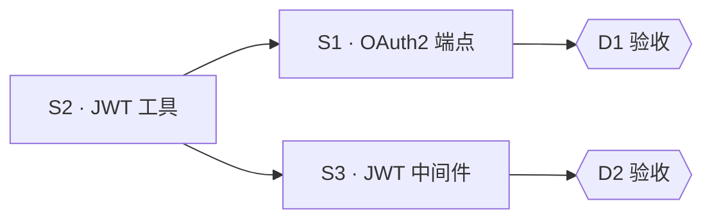

# 编排文档范例

完整填好的 trellis task 编排文档样例, 同一场景 (为 API 加 OAuth2 登录, 2 deliverable / 3 subtask) 贯穿。写 PRD / design / implement / subtask 时**先读对应范例**, 照结构填。

| 文件 | 对应 reference | 展示要点 |
| --- | --- | --- |
| `prd.md` | `prd-orchestration.md` | deliverable 矩阵 + subtask 概览表 + mermaid 调度图 + 验收 + out of scope |
| `design.md` | `design-orchestration.md` | 模块表 (执行层 + 资源边界) + 数据流 + 接口契约 + 取舍 + 回滚 |
| `implement.md` | `implement-orchestration.md` | 有序 checklist (五要素 + 执行层 + 回滚) + 验证汇总 + review gate |
| `subtask/S2-jwt-utils.md` | `subtask-file.md` | 无依赖前置件 + 完整五要素 + dispatch prompt (isolation: worktree) |
| `subtask/S3-jwt-middleware.md` | `subtask-file.md` | 依赖等待 (depends-on S2) + 与 S1 并行 (资源不交) |

## 场景概述

- S2 (JWT 工具) 无依赖, 是 S1/S3 共同前置
- S1/S3 依赖 S2 后并行 (改不同文件)
- 全程在 task worktree 内, 完成合并 + 移除

注: 范例顶部的引言行 (`> 范例 …`) 实际写作时删除。
