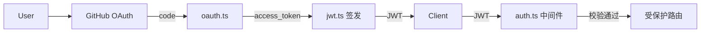

# Design — 为 API 加 OAuth2 登录

> 范例 design — 展示模块表 (执行层 + 资源边界) + 数据流 + 契约 + 取舍 + 回滚 + 风险。实际写作删本行。

## 架构概览



## 模块切分

| 模块 | 职责 | 边界 (输入/输出) | 执行层 | 独占资源 |
| --- | --- | --- | --- | --- |
| `auth/jwt.ts` | JWT 签发/校验/刷新 | in: payload / token; out: token / claims | sub-agent (共享 task worktree) | `packages/api/src/auth/jwt.ts` |
| `auth/oauth.ts` + `routes.ts` | OAuth2 授权码流程 | in: code; out: JWT | sub-agent (共享 task worktree) | `packages/api/src/auth/oauth.ts` `routes.ts` |
| `middleware/auth.ts` | 受保护路由 JWT 校验 | in: req+JWT; out: 401 / next() | sub-agent (共享 task worktree) | `packages/api/src/middleware/auth.ts` `routes/*.ts` |

S1 (oauth) 与 S3 (middleware) 改不同文件, 资源不交 → 可并行; 两者都依赖 S2 (jwt) 产出的签发/校验函数。

## 接口契约

```ts
// auth/jwt.ts
export function signJWT(payload: { userId: string; login: string }): string;
export function verifyJWT(token: string): { userId: string; login: string } | null;
export function refreshJWT(refreshToken: string): string | null;

// auth/oauth.ts
export async function exchangeCode(code: string): Promise<{ accessToken: string; login: string }>;
```

## 数据流

1. 前端跳 GitHub 授权页 → 用户同意 → 回调带 `code`
2. `POST /auth/github/callback` { code } → `exchangeCode(code)` 换 GitHub access_token + 用户 login
3. `signJWT({ userId, login })` 签发 JWT 返前端
4. 后续请求带 `Authorization: Bearer <JWT>` → `middleware/auth.ts` `verifyJWT` 校验 → 通过 next() / 失败 401

## 取舍

| 选项 | 优 | 劣 | 选 |
| --- | --- | --- | --- |
| JWT 无状态 | 无需 session 存储, 水平扩展易 | 无法主动失效 | ✓ (配短有效期 + refresh) |
| Server session | 可主动失效 | 需 Redis, 增依赖 | |

## 兼容性

- 向后兼容: 破坏 (移除静态 .env token); 旧调用方需迁移到 JWT
- 迁移路径: 灰度期同时支持静态 token + JWT, 下个版本移除静态

## 回滚 / 灰度

- 回滚点: feature flag `AUTH_MODE=static|oauth`, 默认 static; 切 oauth 出问题改回 static
- 灰度: 先内部账号测 oauth, 验收后全量

## 风险

| 风险 | 影响 | 缓解 | 触发条件 |
| --- | --- | --- | --- |
| JWT 密钥泄漏 | 身份伪造 | 密钥仅 .env + .gitignore 校验 | 任何密钥进 git |
| GitHub API 限流 | 登录失败 | exchangeCode 加重试 + 错误提示 | 5xx / 429 |
| 中间件漏挂某路由 | 接口裸奔 | S3 验收 grep 全路由确认挂载 | 新增路由未加中间件 |
