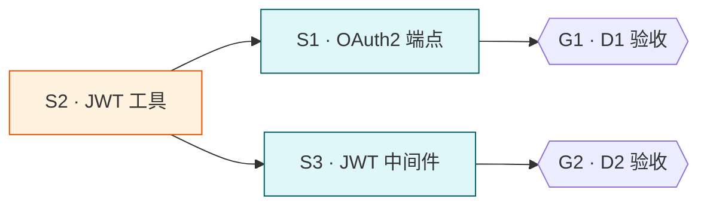

# 为 API 加 OAuth2 登录

> 范例 PRD — 展示 deliverable 矩阵 + subtask 概览 + mermaid 调度图 + 验收 + 范围边界。实际写作时删除本行引言。

## 目标

为 `packages/api` 加 OAuth2 授权码登录, 用户用 GitHub 账号登录后签发 JWT, 受保护接口校验 JWT 通过率 100%。

## 背景与动机

现有 API 仅支持静态 token (写死在 .env), 无法多用户。需接入 GitHub OAuth2 实现真实用户体系。详细调研见 `research/oauth2-provider-comparison.md`。

## Deliverable 矩阵

| ID | 交付物 | 类型 | 独立验收 | 优先级 |
| --- | --- | --- | --- | --- |
| D1 | OAuth2 授权码流程 + JWT 签发 | diff | `POST /auth/github/callback` 返回合法 JWT, `tests/auth/test_oauth.py` 全绿 | P0 |
| D2 | JWT 中间件保护现有接口 | diff | 无 JWT 访问 `GET /api/orders` 返 401, 带合法 JWT 返 200 | P0 |

## Subtask 拆分

每个 subtask 有独立文件 `.trellis/tasks/<task>/subtask/<id>-<slug>.md`。本节仅概览。

| ID | Subtask | 所属 Deliverable | 边界 (改动 / 读取范围) | 简要说明 | 详情文件 |
| --- | --- | --- | --- | --- | --- |
| S1 | 加 OAuth2 授权码端点 | D1 | `packages/api/src/auth/oauth.ts` `packages/api/src/auth/routes.ts` | GitHub 授权回调换 access_token | `subtask/S1-oauth-endpoint.md` |
| S2 | JWT 签发 + 校验工具 | D1 | `packages/api/src/auth/jwt.ts` | 签发 / 校验 / 刷新 JWT | `subtask/S2-jwt-utils.md` |
| S3 | JWT 中间件挂载现有接口 | D2 | `packages/api/src/middleware/auth.ts` `packages/api/src/routes/*.ts` | 受保护路由前置校验 | `subtask/S3-jwt-middleware.md` |

## Subtask 调度图

- S2 (JWT 工具) 是 S1 / S3 的共同前置, 必须先完成
- S1 / S3 依赖 S2 后可并行 (改不同文件, 资源不交)
- G1 / G2 为 deliverable 验收门

## 范围边界

- 在范围内: GitHub OAuth2 授权码流程 / JWT 签发校验 / 现有接口保护
- 不在范围内 (out of scope): 其他 OAuth provider (Google/微信) / 用户资料管理 / 权限分级 (RBAC)
- 禁改: `**/dist/**` `**/*.generated.*` `.trellis/**` `packages/web/**`

## 验收标准 (整体)

- [ ] D1 + D2 全部 P0 deliverable 独立验收通过
- [ ] `cd packages/api && pnpm test auth` 退出码 0
- [ ] 端到端: GitHub 登录 → 拿 JWT → 访问受保护接口 200, 无 JWT 401
- [ ] `pnpm lint && pnpm type-check` 退出码 0

## 约束

- 硬约束: JWT 密钥从 `.env` 的 `JWT_SECRET` 读, 禁硬编码
- 软约束: access_token 有效期 ≤ 1h, refresh_token ≤ 7d

## 风险与决策

| 风险 | 影响 | 缓解 |
| --- | --- | --- |
| GitHub OAuth callback URL 配错 | 登录全失败 | S1 验收含真实回调联调 + 文档记录 callback 配置 |
| JWT 密钥泄漏 | 全用户身份伪造 | 密钥仅 .env, 加 .gitignore 校验; 风险等级 P0 |
