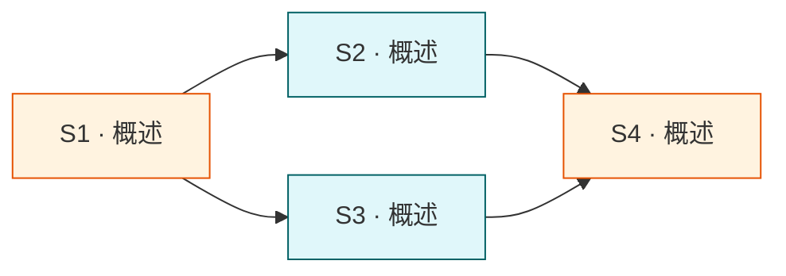

# PRD 编排

`prd.md` = team 章程。必备: 目标 / deliverable 矩阵 / 验收 / **subtask 拆分 + 边界 + 简要说明 + 调度图 (mermaid)**。禁开放式描述。

## 必备结构

```markdown
# <task-title>

## 目标
<一句话, 动词 + 对象 + 结果>

## 背景与动机
<≤ 100 字; 超长落 research/ 后引用>

## Deliverable 矩阵

| ID | 交付物 | 类型 | 独立验收 | 优先级 |
| --- | --- | --- | --- | --- |
| D1 | <名称> | diff / 报告 / 配置 / UI | <可机器或人工验证, 一句话> | P0 |
| D2 | ... | ... | ... | P1 |

## Subtask 拆分

每个 subtask **必须**有独立文件 `.trellis/tasks/<task>/subtask/<subtask-slug>.md` (详细描述见 `subtask-file.md`)。本节仅放概览。

| ID | Subtask | 所属 Deliverable | 边界 (改动 / 读取范围) | 简要说明 | 详情文件 |
| --- | --- | --- | --- | --- | --- |
| S1 | <动词+对象> | D1 | `packages/api/src/auth/**` | <≤ 30 字概述> | `subtask/S1-<slug>.md` |
| S2 | ... | D1 | ... | ... | `subtask/S2-<slug>.md` |
| S3 | ... | D2 | ... | ... | `subtask/S3-<slug>.md` |

## Subtask 调度图

使用 mermaid 表达依赖与并行关系:



图必含:
- 全部 subtask 节点 (ID + 概述)
- 依赖箭头 (上游 → 下游)
- 并行 / 串行视觉区分 (classDef 或子图 subgraph)
- 关键 review gate / 审批点用菱形节点 `G1{{Gate}}`

## 范围边界

- 在范围内: <列举>
- 不在范围内 (out of scope): <列举>
- 禁改: `**/dist/**` `**/build/**` `**/*.generated.*` <项目特定>

## 验收标准 (整体)

- [ ] 全部 P0 deliverable 通过独立验收
- [ ] 跨 deliverable 一致性 (列具体检查项)
- [ ] <任务特定验收, 如性能 / 兼容性 / 文档>

## 约束

- 硬约束: <不可破>
- 软约束: <尽量遵守, 破要解释>

## 风险与决策

| 风险 | 影响 | 缓解 |
| --- | --- | --- |
```

## 写 PRD 的硬规

1. **目标必须包含可验证的结果对象**, 禁 "实现 / 完成 / 优化" 这类不可证伪动词单独使用; 必带"…后 X 行为变为 Y / 文件 Z 存在 / 输出符合 W"。

2. **每个 deliverable 必须独立可验收**, 验收方式必须是命令 / 文件存在性 / 输出对比 / 截图。禁"看起来对"。

3. **禁把 design / implement 内容塞进 PRD**: 不写技术方案、不写文件改动清单、不写代码片段。这些去 design / implement。

4. **out of scope 必填**, 防止"顺手优化"导致任务漂移。

5. **风险必须配缓解**, 仅列风险不给应对 = 没列。

## Multi-deliverable 判定

PRD 列 ≥ 2 个 deliverable 且每个都能独立交付 → **必须**走 parent/child task tree (见 `task-tree.md`)。单 PRD 内塞多 deliverable 后患:
- 验收难以独立
- subtask 拆分边界混乱
- 局部回滚不可行

