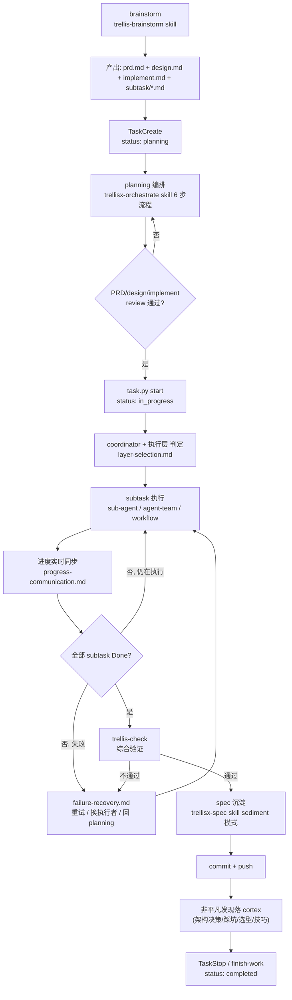

# Trellis Task 生命周期

trellis task 从产生到关闭的完整路径。planning 阶段加载本 reference 让 PRD / design / implement 与生命周期阶段对齐。

## 全景流程

## 阶段表

| 阶段 | 状态 | 触发条件 | 产物 | 关联 skill | 失败回退 |
| --- | --- | --- | --- | --- | --- |
| brainstorm | 无 task | 用户提出新需求 | task 目录草稿 + prd.md 草稿 | `trellis-brainstorm` | 退出, 不建 task |
| planning | `planning` | brainstorm 收敛 | prd.md + design.md + implement.md + `subtask/*.md` + jsonl manifest | `trellisx-orchestrate` (6 步) | 回 brainstorm 重收敛 |
| start review | `planning` → `in_progress` | 用户批准 PRD/design/implement | `task.json` status 翻转 | `selfcheck.md` 自检通过 | 留 planning, 修订 |
| execute | `in_progress` | task.py start | subtask 产物 (diff / 报告 / 测试) | 各 sub-agent / agent-team / workflow | `failure-recovery.md` |
| progress sync | `in_progress` | 每 subtask 完成 / 阻塞 | 用户可见摘要 | `progress-communication.md` | coordinator 决策 |
| check | `in_progress` | 全部 subtask done | check 报告 | `trellis-check` | 单点不过回 execute; 系统性不过回 planning |
| spec sediment | `in_progress` | check 通过 | `.trellis/spec/` 增量 | `trellisx-spec` sediment 模式 | 跳过 (非必须) |
| commit | `in_progress` | spec 沉淀完成 | git commit + push | 通用 git | 修复后重 commit |
| cortex 落档 | `in_progress` | commit 完成 | cortex 笔记 | `cortex-save` / `cortex-ingest` | 必落, 不落不准关闭 |
| stop | `completed` | 全部前置完成 | `task.json` status 翻转 | `/trellis:finish-work` | 卡住时 `task.py status set blocked` |

## 阶段间硬规

- **planning → in_progress 必经 review**: 复杂 task 必须 prd.md + design.md + implement.md 都通过用户审查; 轻量 task 仅 PRD-only 可
- **in_progress 后回 planning 不可跳过 review**: 若执行中发现 PRD 缺漏, 回 planning 改 PRD 后必须再 review
- **check 不通过禁 commit**: trellis-check 单点失败必须修, 系统性失败回 planning 重拆
- **spec 沉淀走 trellisx-spec sediment**: 不直接编辑 `.trellis/spec/`; 必须走 4 阶段 (跳过诊断) + AskUserQuestion 审批门
- **cortex 落档前禁 stop**: 非平凡发现 (架构决策 / 踩坑 / 选型 / 技巧 / 外部综述) 任务结束前必须落 cortex; 未落档不得宣告 Done

## 阶段切换检查表

每次阶段切换前 coordinator 必须:

- [ ] 当前阶段产物全部存在 + 可验证
- [ ] 上游引用清单 (jsonl) 同步更新
- [ ] subtask 状态字段与实际产物一致 (用 `task.py update` 而非直编 json)
- [ ] 用户被告知阶段切换 + 当前进度摘要
- [ ] 切换若不可逆 (e.g. start / commit), 用 AskUserQuestion 强制审批

## 与 trellisx-orchestrate 6 步流程的对应

| orchestrate 工作流步骤 | 生命周期阶段 |
| --- | --- |
| Step 1 PRD 编排 | planning (起步) |
| Step 2 subtask 文件 | planning (中段) |
| Step 3 design 编排 | planning (复杂 task) |
| Step 4 implement 编排 | planning (复杂 task) |
| Step 5 parent/child 拆分 | planning (多 deliverable) |
| Step 6 jsonl curate | planning → start review |

execute / check / sediment / commit / stop 不属 orchestrate 工作流, 由 trellis 自带 skill + 用户决策驱动。
