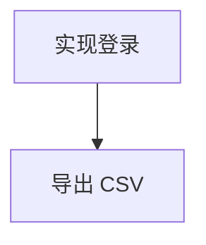

# `.trellis/task.md` 模板

首次创建用此结构; 后续按 id 定位增量更新 (见 `maintenance.md`)。看板文案固定中文。

**一个表格, 一行一个任务**。无活动详情块、无子任务树、无已归档分区 —— 全部任务 (含已完成) 同表, 用「状态」列区分。**状态列用中文显示生命周期阶段** (task.md 是人类可读看板); task.json 真值仍是英文。

```markdown
# Trellis 任务看板

| ID | 名称 | 描述 | 状态 | worktree | 前置 |
| --- | --- | --- | --- | --- | --- |
| 06-13-login | 实现登录 | JWT 登录 + token 刷新 | 实施中 | .worktrees/login | — |
| 06-13-export | 导出 CSV | 报表导出 | 规划中 | — | 06-13-login |
| 06-10-init | 项目初始化 | 脚手架 | 已完成 | — | — |

## 依赖关系图 (DAG)



## Worktree ↔ Task 映射

| worktree | task | 创建源 |
| --- | --- | --- |
| .worktrees/login | 06-13-login | trellisx-start |
| .worktrees/login-sub1 | 06-13-login | subagent |
```

> 产出的 task.md **只含标题 + 表格 + 依赖关系图 (mermaid)**, 无 `>` 注释行/说明块。上方示例外的说明仅本文档用, 不写入 task.md。
>
> **`## 依赖关系图 (DAG)` 段由脚本自动渲染** —— 每次写盘从主表「前置」列重建 (无任何依赖边则不出此段), AI/hook 无需手维护, 改依赖只改前置列 (`update --deps`), 图跟着变。

> **映射区是唯一允许的额外 section** (主表外的例外): worktree 可能由 subagent isolation / 手动
> `git worktree add` 建, 无对应主表行; 此区显式登记每个活跃 worktree 归属哪个 task。**一行一
> worktree, 同 task 可多行 (一对多)**。经 `trellisx-taskmd.py map-add/map-remove/map-get/map-list`
> 维护 (guard hook 调用), AI 勿手编。

## 字段 (一行一任务, 6 列)

| 列 | 说明 | 取值 (中文显示 ↔ task.json 英文真值) |
| --- | --- | --- |
| ID | task 目录名 | `MM-DD-slug` |
| 名称 | 任务标题 | 短语 |
| 描述 | 一句话目的 | ≤ 30 字 |
| 状态 | 生命周期阶段 (合并原"状态"+"阶段", 删"进度") | 规划中 ↔ planning / 实施中 ↔ in_progress / 检查中 (AI 细分) / 收尾 (AI 细分) / 已完成 ↔ completed / 已归档 ↔ archived |
| worktree | 隔离工作区 | `.worktrees/<name>` 或 `—` |
| 前置 | 该 task 依赖的前置 task ID (task 级 DAG) | 前置 tid 逗号分隔 ↔ `task.json.depends_on`; **仅有依赖者标, 无依赖填 `—`**。经 `update --deps` 双写 (task.json + 看板) |

## 状态列取值 (生命周期阶段)

| 状态 (中文) | 含义 | 谁写 | 对应 trellis status |
| --- | --- | --- | --- |
| 规划中 | 规划中 (写 prd/design/implement) | hook sync | planning |
| 实施中 | 实施中 | hook sync / AI | in_progress |
| 检查中 | 质量验证中 | AI update | in_progress |
| 收尾 | 已通过 check / merge+archive 前 | AI update | in_progress |
| 已完成 | 已归档 | hook sync (archive) | completed |
| 已归档 | 已归档 | hook sync | archived |

> **冲突规则**: hook sync 写基础态; 若 AI 已写细分 (实施中/检查中/收尾) 且 task 仍 in_progress, hook sync 不覆 AI 细分。

> 空看板保留表头。已完成任务行保留在表内 (状态 已完成), 不单设归档区。
> 维护时按 task.json 的英文 status 映射成中文写入 task.md。

## 禁 (结构红线)

| 禁 | 替代 |
| --- | --- |
| 加活动详情块 / 子任务树 | 一任务一行, 细节留 task 文件夹 (prd/design/implement) |
| 单设「已归档」分区 | 已完成行同表, 用「状态」列区分 |
| 描述写成多句长文 | ≤ 30 字一句话目的 |

> **例外 (仅两个, 均脚本维护)**: `## 依赖关系图 (DAG)` (脚本从前置列自动渲染) + `## Worktree ↔ Task 映射` (map-* 维护); 其余「主表外加 section」仍禁。
